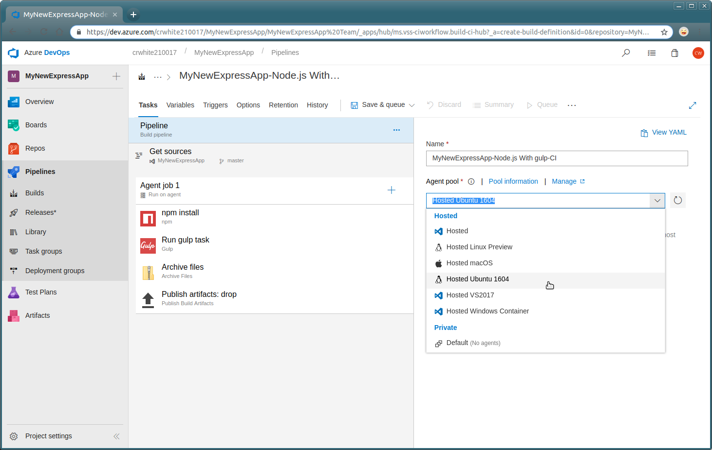
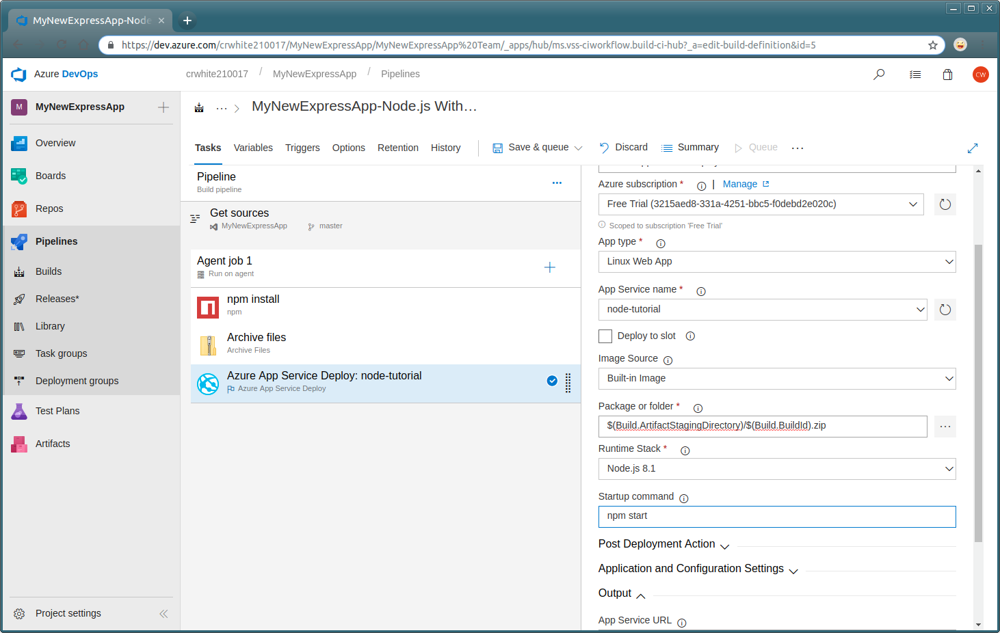

## Overview

In this lab, we will present a scenario where Azure DevOps can enable Node.js developers with continuous integration and deployment features. The scenario demonstrates how a Node.js developer using [Visual Studio Code](http://code.visualstudio.com) and various Azure-related VS Code extensions to create a new Azure App Service and use Git-based deployment. You'll learn how a Node.js developer can use Azure DevOps to ensure that their code is deployed automatically to an Azure App Service when code is committed to an Azure DevOps Git repository.

## Prerequisites

1. If you don't already have an Azure subscription, create one [here](https://azure.microsoft.com/en-us/free/).
1. Install Git if you don't already have it installed.
1. Install Node.js either by using the downloadable installers from [Node.js](https://nodejs.org) or using various command-line tools. Mac users can install Node.js using [Homebrew](https://brew.sh/) using the command `brew install node`.
1. Install [Visual Studio Code](http://code.visualstudio.com).
1. Install the [Azure App Service Tools](https://marketplace.visualstudio.com/items?itemName=ms-azuretools.vscode-azureappservice) using the VS Code Extensions Palette (search for *azure*).
1. Once you have installed Visual Studio Code and the App Service Tools extension, open Visual Studio Code. In Code, use `Ctrl-Shift-P` (or `Cmd-Shift-P` on a Mac) to open up the command palette. Type the word `path` to filter the command menu, and then select the command **Install 'code' command in PATH** to make it easy to open Visual Studio Code from your command line.

    

## Demo Steps

[Express](https://expressjs.com/) is a minimal, flexible web application framework for Node.js developers that provides a robust set of features for both web and mobile web developers. The [Express package](https://www.npmjs.com/package/express) is available via [NPM](https://www.npmjs.com/), easily installable into any Node.js application using the command `npm install express`. In most cases Express needn't be installed as a global package using the `-g` NPM switch, as the convention is that Express is installed independently into each Node.js app during development.

This demo will walk you through the process of creating a new Node.js web app that uses Express. Then you'll create a new Azure DevOps project to use for storing the code and continuously deploying the app to Azure App Service.

## Scaffolding a new Express app

### Install the Express generator

1. Run the command `npm install -g generator-express`.

### Generate a skeleton Express app

1. In the command prompt, enter the command `express --view=pug myapp` to create a new Express application.

    

1. Enter the command `code .` to start Visual Studio Code with the new Express app's folder open.

    

## Create an Azure App Service using VS Code

There are a number of various extensions for VS Code that provide Azure functionality. Extensions like the [Azure CLI Tools](https://marketplace.visualstudio.com/items?itemName=ms-vscode.azurecli) make it easy to write scripts that make use of the [Azure CLI](http://docs.microsoft.com/cli/azure) to perform administrative tasks in your Azure nn.

The [Azure App Service Tools for VS Code](https://marketplace.visualstudio.com/items?itemName=ms-azuretools.vscode-azureappservice) provide a series of convenient features for creating new Azure App Services.

### Login to your Azure subscription

1. Expand the Azure App Service Tools pane. Click the `Sign in to Azure` gesture in the explorer pane.

    

1. Click `Copy and Open` to open the browser and log in to your Azure subscription.

    

1. Hit `Ctrl-V` or `Cmd-V` on Mac, or use the context menu to paste the login code into the textbox.

    

1. Click the **Continue** button to perform the login routine.

    

    Once you click Continue, you'll be able to select which of the organizational or Microsoft accounts you want to use to login to your Azure subscription.

    

1. Once the login page loads, flip back to VS Code. You should see all of your Azure subscriptions in the App Service pane. When you expand the pane, all of your App Services are visible.

    

### Create the App Service Web App

To setup continuous deployment to an Azure App Service, an Azure App Service resource must be created into which code can be deployed. Luckilly, Visual Studio, Visual Studio for Mac, and Visual Studio Code all make this a rather easy task directly within the various IDEs.

1. In VS Code, right-click the subscription you want to use and select the `Create New Web App` menu option.

    

1. Type in a name for the App Service. Note, if an existing App Service with this name exists you'll be informed with an error message.

    

1. Select the Node.js version your app will need. VS Code will try to determine this for you but you have the option to choose your version.

    

1. Visual Studio Code will provide a stream of information as the resources are being created in your subscription.

    

1. Once the App Service is created, it will appear in the App Service Explorer pane

    

### Viewing the new App Service in the Azure Portal

1. In VS Code, right-click on the App Service to open the context menu. Select the `Open in Portal` option to open the new App Service in the Azure Portal.

    

1. Once you select an App Service to view within VS Code it'll open directly in the Azure portal in your default browser. Click the link in the portal's overview section to open the new App Service in a separate tab.

    

1. The App Service should open in your browser, displaying the default App Service start page.

    

## Use Azure DevOps to Enable Continuous Deployment

Now that the app is ready to be deployed we'll set up a new Azure DevOps project and set it up with Git so the code can be easily committed and continuously deployed.

### Create the new Azure DevOps Project

1. Browse to your Azure DevOps account at [https://dev.azure.com/{youraccount}](https://dev.azure.com/{youraccount}). Give the project a name and click **Create**.

    

1. If you haven't already created Git credentials click the **Generate Git credentials** button, then provide a username and password to be used when interacting with this project. Then, click the **Copy clone url to clipboard** button as shown below.

    

1. At a command prompt in your project's folder, type the command `git init` to initialize a new repository locally. Then, type `git remote add origin {copied URL}` to add the remote to your local repository. Then, `add` and `commit` the files to the repository. Finally, use `git push origin master` to push the Express app code up to the Azure DevOps project's Git repository.

    

1. Click on the **Files** tab in your Azure DevOps browser.

    

### Create the Build Definition

1. Click the **Set up build** button in the **Files** page in the browser.

    

1. Click **use the visual designer**.

    

1. Select the repository you created earlier and click `Continue`.

    

1. Search for `node` and select `Node.js with gulp`. Click `Apply`.

    

1. Choose `Hosted Ubuntu 1604` for the `Agent pool`.

    

1. Remove `Run gulp task` and `Publish artifacts: drop` tasks.

    

1. Click the **Archive files** build task to see the details of this task.

    

1. Click the **Add Task** button under the list of build tasks. Select the **Azure App Service Deploy** task and click the **Add** button next to it.

    

1. Note that the **Azure subscription** and **App Service name** menus are both required.

    

1. Select the Azure subscription in which your destination App Service is housed.

    

1. Change the **App Type** to **Linux Web App**.

    

1. Select the App Service you created earlier within VS Code to use as the deployment target for your Node.js source code.

    

1. Change **Image Source** to **Built-in image**.

    

1. Click the previous build task (the **Archive files** task) and take note of the **Archive file to create** textbox. Once you've copied these two value and pasted them both into the Deploy build task, the value of the task's **Package or folder** textbox should represent the full path the ZIP file being built by your DevOps build.

    

1. Select **Node.js 8.1** for **Runtime Stack**.

    

1. Enter `npm start` in the **Startup command** textbox.

    

1. Click `Triggers`.

    

1. Check `Enable Continuous Integration`.

    

### Run the Build

Now the build definition is complete running it will result in the code being deployed to the Azure App Service.

1. To kick off the manual build, click the **Save & queue** spin button in the build definition page. Then, select the **Save & queue** option to save the definition and trigger the build.

    

1. Click the **Save & queue** button on the **Save build pipeline and queue** dialog.

    

1. Click the queued build link to drill into the running build.

    

1. The build log is visible in the browser.

    

1. Wait until the build has completed.

    

1. Open up a browser (or refresh the already open browser tab) on the App Service URL.

    

### Triggering a build

1. Edit the code in `routes/index.js` so that the `title` property is `My Express App` on the `GET home page` route.

    

1. Commit the code to the repository.

    

1. Go back to the build definition in Azure DevOps and take note that a new build has been queued.

    

1. Refresh the site in the browser.

    